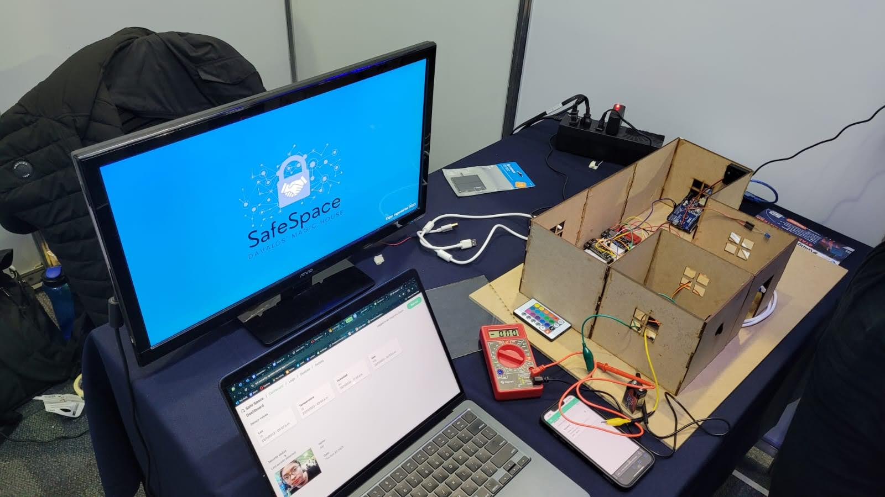
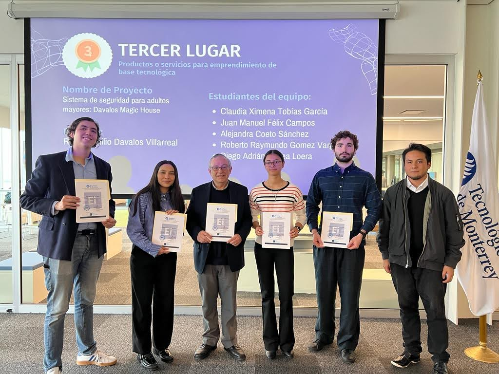

# Davalo-s_Magic_House
## 3rd place "Expo Ingenierias 2023" category "Producto o servicio para emprendimiento de base tecnologica"
This project addresses the critical challenge of the well-being of the growing elderly population living alone through a comprehensive solution for security and monitoring. With the projected increase in the elderly population, SafeSpace utilizes advanced technologies such as artificial intelligence facial recognition, gas and temperature sensors, and other devices to detect and prevent risks at home. The system also automates functions like door opening and provides remote monitoring through an intuitive web interface.

  

In the context of the demographic transition toward an aging population, SafeSpace aims to improve the quality of life for older adults by offering independence, security, and peace of mind to their families. The technical feasibility of the project is supported by the use of computational technologies and the implementation of hardware such as NodeMCU ESP32, sensors, and actuators. From an economic perspective, the smart home security market shows significant growth, supporting the financial viability of the project.

The project methodology covers both hardware and software development, utilizing tools such as Python, SolidWorks, and Arduino IDE. The results include a functional prototype with early risk detection systems, facial recognition, home automation, and remote monitoring. Operational feasibility is supported by the creation of suitable infrastructure and the use of resources such as ESP32, sensors, and actuators.

Check out more about this project in our [demo video](https://youtu.be/ADH4FWjCIjY), where we walk through the features and demonstrate how to use the application.

  

